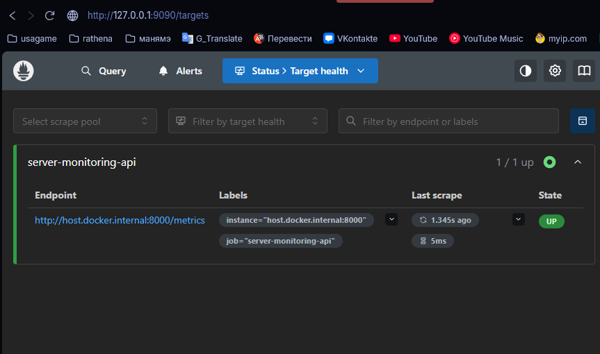
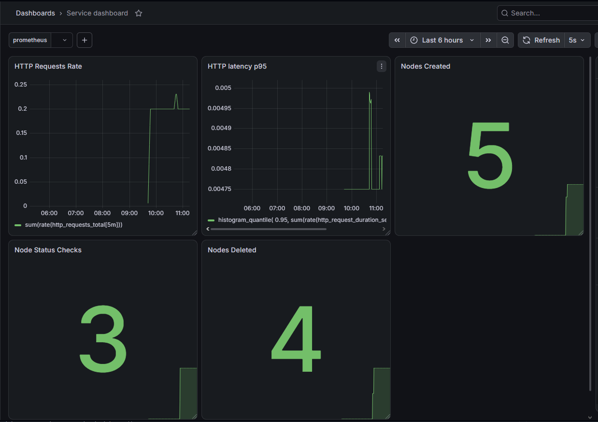

# Лабораторная работа №3: Метрики

Добавление метрик в сервис мониторинга серверных узлов с использованием Prometheus и Grafana.

## Технологии

* Python, FastAPI
* prometheus-client
* Prometheus
* Grafana
* Docker Compose

## Метрики

### Стандартные

| Метрика                         | Тип       | Описание                       |
| ------------------------------- | --------- | ------------------------------ |
| `http_requests_total`           | Counter   | Количество HTTP-запросов       |
| `http_request_duration_seconds` | Histogram | Время выполнения HTTP-запросов |

### Продуктовые

| Метрика                    | Тип     | Описание                 |
| -------------------------- | ------- | ------------------------ |
| `nodes_created_total`      | Counter | Созданные узлы           |
| `nodes_deleted_total`      | Counter | Удалённые узлы           |
| `node_status_checks_total` | Counter | Проверки состояния узлов |

## PromQL

```promql
sum(rate(http_requests_total[5m]))
```

```promql
histogram_quantile(
  0.95,
  sum(rate(http_request_duration_seconds_bucket[5m])) by (le)
)
```

```promql
nodes_created_total
nodes_deleted_total
node_status_checks_total
```

## Prometheus

Prometheus собирает метрики приложения через `/metrics`.

Target: `server-monitoring-api` — **UP**.



## Grafana

Создан dashboard `service dashboard` с панелями:

* HTTP Requests Rate
* HTTP Latency p95
* Nodes Created
* Nodes Deleted
* Node Status Checks



## Запуск

```cmd
uvicorn app.main:app --reload
docker compose up -d
```

* Приложение: `http://127.0.0.1:8000`
* Метрики: `http://127.0.0.1:8000/metrics`
* Prometheus: `http://127.0.0.1:9090`
* Grafana: `http://127.0.0.1:3000`
