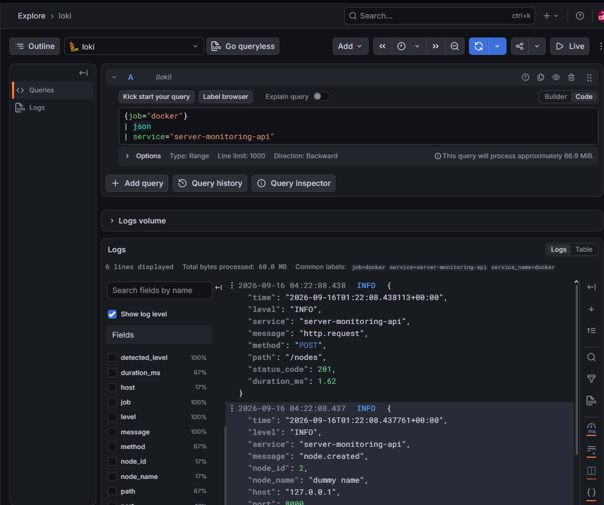

# Lab4: Журналирование

Добавляем структурированного журналирования и сбор логов контейнеров в Loki с использованием Grafana Alloy и Grafana.

## Технологии

Python + FastAPI + logging
Grafana Alloy (сбор логов)
Loki (хранение логов)
Grafana + LogQL (просмотр и анализ)

## Доступ к сервисам

Loki: http://localhost:3100
Grafana: http://localhost:3000

Схема сбора:

```
FastAPI stdout -> Docker logs -> Grafana Alloy -> Loki -> Grafana / LogQL
```

Alloy обнаруживает контейнеры через Docker socket. Loki хранит данные в
Docker volume `loki-data`. Grafana datasource и dashboard создаются из файлов provisioning при запуске

## Примеры запросов LogQL

```logql
# все логи
{job="docker"}

# логи приложения
{job="docker"} |= "server-monitoring-api"

# создание узла
{job="docker"} |= "node.created"

# HTTP реквесты
{job="docker"} |= "http.request"
```

## Структура логов

Логи приложения записываются в JSON и содержат основные поля:

| Поле      | Описание            |
| --------- | ------------------- |
| time      | Время события       |
| level     | Уровень логирования |
| service   | Имя сервиса         |
| message   | Событие             |
| node_id   | ID узла             |
| node_name | Имя узла            |
| host      | Адрес узла          |
| port      | Порт узла           |

## Результат

Логи приложения собираются Grafana Alloy из контейнера, передаются в Loki и после их можно найти в Grafana.

Для демонстрации события создаётся узел:

```
curl.exe -X POST http://127.0.0.1:8000/nodes -H "Content-Type: application/json" -d "{\"name\":\"dummy name\",\"host\":\"127.0.0.1\",\"port\":8000}"
```

Запрос `{job="docker"} | json | service="server-monitoring-api"` позвляет найти лога от нашего curl.


