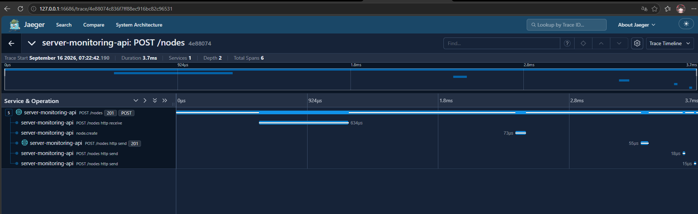

# Лабораторная работа №5: Распределённая трассировка

Добавлена  трассировка сервиса с передачей trace и span в Jaeger через OpenTelemetry OTLP

## Технологии

* OpenTelemetry API и SDK
* OpenTelemetry FastAPI instrumentation
* OTLP gRPC exporter
* Jaeger
* Docker Compose

## Архитектура

```
HTTP client -> FastAPI -> OpenTelemetry SDK -> OTLP gRPC -> Jaeger -> Jaeger UI
```

Сервис API отправляет данные в Jaeger по адресу `http://jaeger:4317` внутри
Docker'a. UI Jaeger'a доступен по адресу
`http://127.0.0.1:16686`

## Spans

FastAPI автоматически создаёт HTTP span для входящего запроса. В коде сервиса
добавлены свои span:

| Span | Назначение |
| --- | --- |
| `node.create` | создание узла и обновление метрики |
| `node.status_check` | проверка доступности узла |

Таким образом, trace запроса создания узла содержит HTTP span и вложенный
`node.create`, а trace статуса содержит HTTP span и вложенный
`node.status_check`

## Запуск и демонстрация

```cmd
docker compose up -d --build
curl.exe -X POST http://127.0.0.1:8000/nodes -H "Content-Type: application/json" -d "{\"name\":\"Lab 5 trace test\",\"host\":\"127.0.0.1\",\"port\":8000}"
```

После запроса, если открыть Jaeger UI, выбрать сервис `server-monitoring-api`,
открыть самый свежий trace и показать дерево из двух заданных span.

Jaeger показывает 6 span
и глубину 2, включая `POST /nodes` и `node.create`.

